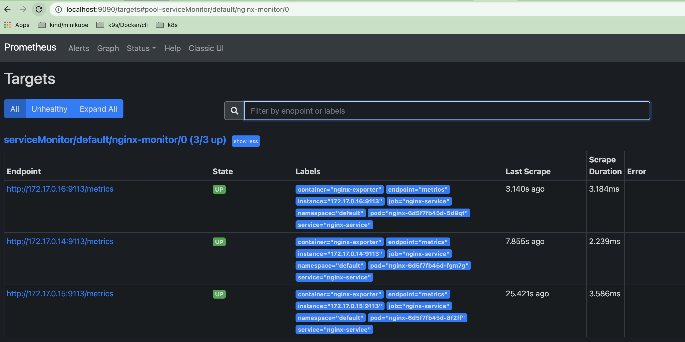
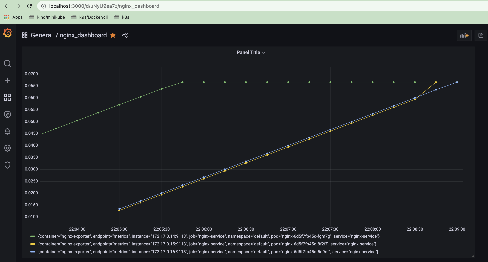

## 8. Kubernetes-Monitoring

### Installation Kube-Prometheus-Stack. Custom NGINX with nginx-prometheus-exporter

1. Установил 2 разными способами kube-prometheus-stack.

   - Установка с помощью Helm3: [Helm3, Service type NodePort for Grafana/Prometheus ](https://itsecforu.ru/2021/04/12/%E2%98%B8%EF%B8%8F-%D0%BA%D0%B0%D0%BA-%D1%83%D1%81%D1%82%D0%B0%D0%BD%D0%BE%D0%B2%D0%B8%D1%82%D1%8C-prometheus-%D0%B8-grafana-%D0%BD%D0%B0-kubernetes-%D1%81-%D0%BF%D0%BE%D0%BC%D0%BE%D1%89%D1%8C%D1%8E-h/)

   ```sh
      # Installation repo
      helm repo add stable https://charts.helm.sh/stable
      helm repo add prometheus-community https://prometheus-community.github.io/helm-charts
      helm search repo prometheus-community
      helm install stable prometheus-community/kube-prometheus-stack
      
      # Checking
      kubectl --namespace default get pods -l "release=stable"

      # Changing service type for Grafana/Prometheus/Alertmanager (optional)
      kubectl edit svc stable-kube-prometheus-sta-prometheus
      kubectl edit svc stable-grafana
      k get svc
   ```

   - Установка через манифесты: [Manifests](https://github.com/prometheus-operator/kube-prometheus/tree/release-0.10#minikube)

   ```sh
      # Starting minikube, disable addon metrics-server
      minikube start --kubernetes-version=v1.20.0 --memory=6g --bootstrapper=kubeadm --extra-config=kubelet.authentication-token-webhook=true --extra-config=kubelet.authorization-mode=Webhook --extra-config=scheduler.bind-address=0.0.0.0 --extra-config=controller-manager.bind-address=0.0.0.0

      minikube addons disable metrics-server

      # Cloning official repo
      git clone https://github.com/prometheus-operator/kube-prometheus.git
      cd kube-prometheus/

      # Create the namespace and CRDs, and then wait for them to be available before creating the remaining resources
      kubectl apply --server-side -f manifests/setup

      # Create kube-prometheus-stack
      kubectl apply -f manifests/

      # Checking
      k get all --all-namespaces

      # Port-forward for Grafana/Prometheus/Alertmanager (optional)
      kubectl --namespace monitoring port-forward svc/prometheus-k8s 9090
      kubectl --namespace monitoring port-forward svc/grafana 3000
   ```

2. Конфигурирование nginx и nginx-prometheus-exporter, prometheus-operator.
   
   [Part1](https://kamaok.org.ua/?p=3224)
   [Part2](https://sassoft.ru/%D0%BC%D0%BE%D0%BD%D0%B8%D1%82%D0%BE%D1%80%D0%B8%D0%BD%D0%B3-nginx-%D0%BF%D1%80%D0%B8-%D0%BF%D0%BE%D0%BC%D0%BE%D1%89%D0%B8-stub_status-%D0%B8-prometheus-exporter-%D1%87%D0%B0%D1%81%D1%82%D1%8C-2/)
   [link](https://igou.io/blog/20191231-nginx-exporter/)
   [Prometheus-operator](https://github.com/prometheus-operator/prometheus-operator/blob/main/Documentation/user-guides/getting-started.md)

3. Развертывание nginx и nginx-prometheus-exporter.

   ```sh
   k apply -f nginx-configmap.yaml -f nginx-deployment.yaml -f nginx-service.yaml -f nginx-servicemonitor.yaml -f nginx-rules.yaml

    # Checking
    k get all -n default
   ```

4. PROMETHEUS METRICS.


5. GRAFANA DASHBOARD (see nginx_dashboard.json).
