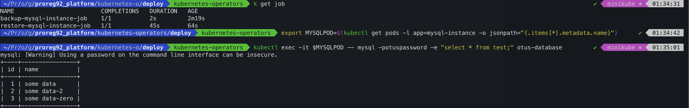

### CRD/Operator 7 Task done.

Kubernetes-Operators

1. Создаем CustomResource, CustomResourceDefinition.
2. Отладка и валидация актуальной версии апихи кубернетес, отладка манифестов.
3. Создание и проверка секрета для БД.
4. Создание оператора на питоне, отладка кода питона (удаление pv, generateName, k patch finalizers pv, etc), отладка версий необходимых пакетов.
5. Тестирование оператора. Тестирование записи в БД и ее проверка.
6. Развертывание оператора в k8s кластере. Применяем манифесты:
   - role-binding.yml.yml
   - cr.yml
   - crd.yml
   - deploy-operator.yml
   - role.yml
   - service-account.yml
7. Запись в базу и проверка на чтение.
8. Удаляем mysql-instance и пересоздание.
9. Проверка восстановления БД.

```sh
k get jobs
NAME                         COMPLETIONS   DURATION   AGE
backup-mysql-instance-job    1/1           4m59s      4m59s
restore-mysql-instance-job   1/1           11m        11m


kubectl exec -it $MYSQLPOD -- mysql -potuspassword -e "select * from test;" otus-database
+----+-------------+
| id | name        |
+----+-------------+
|  1 | some data   |
|  2 | some data-2 |
|  3 | some data-3 |
+----+-------------+
```

P.S. Результаты после дебага оператора и тестирования нескольких идей/фиксов/work-around



1. Root cause: mysql-pv не удалялся представленным питоновским кодом оператора из-за финалайзера
Подробнее [Finalizers](https://kubernetes.io/blog/2021/05/14/using-finalizers-to-control-deletion/)
2. Как можно пофиксить или обойти эту проблему:
   - я изменил static name в темлейте mysql-pv.yml.j2 на генерацию динамических имен generateName
   - проверил, все работает, только надо не забывать удалять старые pv
3. Еще один способ этого избежать: патчить pv или редактировать манифест перед удалением CR

```sh
kubectl patch configmap/mymap \
    --type json \
    --patch='[ { "op": "remove", "path": "/metadata/finalizers" } ]'
```
